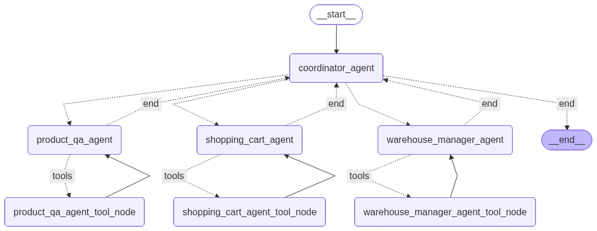

# 🛒 AI Shopping Assistant — Агентный чат-бот для интернет-магазина

> Full-stack AI-приложение на основе LangGraph, FastAPI, Streamlit, MCP-серверов, PostgreSQL и протокола Google A2A. Пользователь общается с ботом на естественном языке: ищет товары, добавляет в корзину и резервирует их со склада.

---

## 📌 Описание проекта

**AI Shopping Assistant** — это сквозное агентное приложение, которое демонстрирует, как строить production-ready AI-системы за пределами простых LLM-обёрток. В основе — **многоагентный пайплайн на LangGraph**, который управляет вызовом инструментов, памятью разговора, семантическим поиском товаров (через Qdrant) и резервированием складских остатков через выделенные **MCP-серверы (Model Context Protocol)**.

Проект также содержит реализацию **Warehouse Manager Agent** в двух вариантах по протоколу **Google A2A (Agent2Agent)**: один на основе официального `a2a-sdk`, другой с использованием **Google ADK** — демонстрируя взаимодействие независимых агентов через стандартизированный протокол.

Проект полностью контейнеризован с помощью Docker Compose и поддерживает несколько LLM-провайдеров: **OpenAI**, **Google Gemini** и **Groq**.

---

## ✨ Возможности

- 💬 **Диалоговый шопинг** — пользователь ищет товары, читает отзывы и управляет корзиной через обычный чат
- 🧠 **Агентная система на LangGraph** — координатор-агент маршрутизирует запросы между специализированными подагентами (поиск, корзина, резервирование)
- 🗂️ **Персистентная память** — история диалога сохраняется в PostgreSQL через `langgraph-checkpoint-postgres` и не теряется при перезапуске
- 🔍 **Семантический поиск** — каталог товаров проиндексирован в векторной базе **Qdrant** для поиска по смыслу
- 📦 **Резервирование склада** — интеграция логики бронирования остатков прямо в агентный пайплайн
- 🔌 **MCP-серверы** — микросервисы `items_mcp_server` и `reviews_mcp_server` предоставляют инструменты агенту по протоколу MCP
- 📊 **Система оценки качества** — RAGAS-based эвалюации для ретривера и агента-координатора
- 🤝 **Протокол Google A2A** — агент управления складом реализован как самостоятельный A2A-совместимый сервис, совместимый с любой A2A-системой
- 🏭 **Два варианта A2A-агента** — реализация через `a2a-sdk` (низкий уровень) и через **Google ADK** с `RemoteA2aAgent` (высокий уровень)
- 🧪 **LangSmith** — трассировка и наблюдаемость всех агентных запусков
- 🐳 **Docker Compose** — весь стек запускается одной командой

---

## 🏗️ Архитектура

```
┌─────────────────────────────────────────────────────────┐
│                  Streamlit UI  (:8501)                   │
│            (chatbot_ui — интерфейс чата)                 │
└───────────────────────┬─────────────────────────────────┘
                        │ HTTP
┌───────────────────────▼─────────────────────────────────┐
│               FastAPI Backend  (:8000)                   │
│        LangGraph Coordinator Agent + Память              │
│           (langgraph-checkpoint-postgres)                │
└────┬─────────────────┬──────────────────┬───────────────┘
     │ MCP             │ MCP              │
┌────▼────┐      ┌─────▼──────┐    ┌─────▼──────────┐
│  Items  │      │  Reviews   │    │    Qdrant       │
│  MCP    │      │  MCP       │    │  Vector Store   │
│ (:8001) │      │  (:8002)   │    │   (:6333)       │
└─────────┘      └────────────┘    └────────────────┘
                        │
              ┌─────────▼──────────┐
              │    PostgreSQL       │
              │  (langgraph_db)    │
              │     (:5433)        │
              └────────────────────┘

         Протокол Google A2A (agent-to-agent)
┌────────────────────────────────────────────────────┐
│            Warehouse Manager Agent                 │
│                                                    │
│  ┌─────────────────────┐  ┌─────────────────────┐ │
│  │  a2a_warehouse_     │  │  adk_warehouse_     │ │
│  │  manager_agent      │  │  manager_agent      │ │
│  │  (raw a2a-sdk)      │  │  (Google ADK)       │ │
│  └─────────────────────┘  └─────────────────────┘ │
│     ↑ JSON-RPC 2.0 / Agent Card discovery          │
└────────────────────────────────────────────────────┘
```

**Сервисы (Docker Compose):**

| Сервис | Порт | Описание |
|---|---|---|
| `streamlit-app` | 8501 | Чат-интерфейс (Streamlit) |
| `api` | 8000 | FastAPI бэкенд + LangGraph агент |
| `items_mcp_server` | 8001 | MCP-сервер инструментов каталога товаров |
| `reviews_mcp_server` | 8002 | MCP-сервер инструментов отзывов |
| `qdrant` | 6333 | Векторная база данных |
| `postgres` | 5433 | Хранение состояния диалога |

---

## 🤖 Агентный флоу

### Mermaid diagram 


```
Сообщение пользователя
         │
         ▼
Coordinator Agent (LangGraph)
         │
         ├──► product_qa_agent          →  консультант по покупкам, отвечающий на вопросы покупателей о товарах, отзывы и рейтинги товаров
         ├──► shopping_cart_agent       →  управление корзиной покупок пользователя
         ├──► warehouse_manager_agent   →  управление имеющимся запасом товаров на складе и резервирование товаров со склада
         ├──► items_mcp_server          →  MCP-сервер инструментов каталога товаров
         ├──► reviews_mcp_server        →  MCP-сервер инструментов отзывов
         └──► Qdrant retriever          →  семантический поиск по каталогу
```

Агент-координатор использует **tool-calling** для выбора нужных MCP-инструментов в зависимости от намерения пользователя. Состояние диалога сохраняется между сообщениями через PostgreSQL-чекпоинтер LangGraph.

---

## 🤝 Протокол Google A2A — Warehouse Manager Agent

Проект включает отдельный **агент управления складом**, реализованный по протоколу [Google Agent2Agent (A2A)](https://github.com/a2aproject/A2A) — открытому стандарту агентного взаимодействия, переданному под управление Linux Foundation.

Реализованы два варианта — для сравнения подходов:

| Вариант | Директория | Подход |
|---|---|---|
| **Raw A2A SDK** | `apps/a2a_warehouse_manager_agent/` | Низкоуровневая реализация на официальном `a2a-sdk`: HTTP-сервер с JSON-RPC 2.0 и Agent Card для автодискавери |
| **Google ADK** | `apps/adk_warehouse_manager_agent/` | Высокоуровневая реализация через `google-adk` и `RemoteA2aAgent` — ADK сам обрабатывает Agent Card, сериализацию и транспорт |

**Как работает A2A в проекте:**

```
LangGraph Coordinator (или любой A2A-клиент)
           │
           │  JSON-RPC 2.0 over HTTP
           │  Agent Card: /.well-known/agent.json
           ▼
  Warehouse Manager A2A Server
  ┌─────────────────────────────────┐
  │  - check_stock(item_id)         │
  │  - reserve_items(item_id, qty)  │
  │  - release_reservation(...)     │
  └─────────────────────────────────┘
```

A2A-агент публикует свои возможности через **Agent Card** — машиночитаемый манифест по адресу `/.well-known/agent.json`. Любой A2A-совместимый клиент может обнаружить и вызвать агент без знания деталей его реализации.


**AI / Агенты**
- [LangGraph](https://github.com/langchain-ai/langgraph) — оркестрация stateful multi-agent систем
- [LangChain MCP Adapters](https://github.com/langchain-ai/langchain-mcp-adapters) — подключение MCP-серверов к LangGraph
- [FastMCP](https://github.com/jlowin/fastmcp) — фреймворк для MCP-серверов
- [a2a-sdk](https://github.com/a2aproject/A2A) — официальный Python SDK протокола Google A2A
- [Google ADK](https://github.com/google/adk-python) — Agent Development Kit с `RemoteA2aAgent` для высокоуровневой A2A-интеграции
- [LangSmith](https://smith.langchain.com/) — трассировка и наблюдаемость
- [RAGAS](https://docs.ragas.io/) — фреймворк для оценки RAG-систем

**LLM-провайдеры**
- OpenAI (GPT-4o и др.)
- Google Gemini (через `google-genai`)
- Groq (Llama, Mixtral и др.)

**Бэкенд**
- [FastAPI](https://fastapi.tiangolo.com/) — асинхронный REST API
- [PostgreSQL 16](https://www.postgresql.org/) — персистентность состояния агента
- [Qdrant](https://qdrant.tech/) — векторная база данных

**Фронтенд**
- [Streamlit](https://streamlit.io/) — интерактивный чат-интерфейс

**Инфраструктура и инструменты**
- [uv](https://github.com/astral-sh/uv) — быстрый менеджер Python-пакетов (workspace)
- Docker Compose — оркестрация сервисов
- GitHub Actions — CI/CD

---

## 🚀 Быстрый старт

### Требования
- Docker и Docker Compose
- API-ключ хотя бы одного LLM-провайдера (OpenAI, Google или Groq)

### 1. Клонировать репозиторий
```bash
git clone https://github.com/baizhigit/ai-eshop-assistant.git
cd ai-eshop-assistant
```

### 2. Настроить переменные окружения
```bash
cp env.example .env
# Открыть .env и добавить ключи:
# OPENAI_API_KEY=sk-...
# GOOGLE_API_KEY=...
# GROQ_API_KEY=...
```

### 3. Запустить все сервисы
```bash
make dc-up
```

Команда выполняет `uv sync` + `docker compose up --build` — собирает и запускает все 6 сервисов.

### 4. Открыть чат
Перейти по адресу **http://localhost:8501** в браузере.

---

## 📁 Структура проекта

```
ai-eshop-assistant/
├── apps/
│   ├── api/                            # FastAPI бэкенд + LangGraph агент
│   │   └── src/
│   │       └── evals/                  # Скрипты оценки качества (RAGAS)
│   ├── chatbot_ui/                     # Streamlit чат-интерфейс
│   ├── items_mcp_server/               # MCP-сервер: инструменты каталога товаров
│   ├── reviews_mcp_server/             # MCP-сервер: инструменты отзывов
│   ├── a2a_warehouse_manager_agent/    # Агент склада через raw a2a-sdk
│   │   └── warehouse_manager_agent/
│   └── adk_warehouse_manager_agent/    # Агент склада через Google ADK
│       └── warehouse_manager_agent/
├── notebooks/                          # Исследовательские Jupyter-ноутбуки
├── scripts/sql/                        # SQL-скрипты инициализации БД
├── docker-compose.yml
├── pyproject.toml                      # Конфигурация uv workspace
├── Makefile                            # Удобные команды для разработки
└── env.example
```

---

## 🧪 Запуск оценок

```bash
# Оценка качества ретривера
make run-evals-retriever

# Оценка поведения агента-координатора
make run-evals-coordinator-agent
```

Эвалюации используют метрики **RAGAS** и запускаются против живого FastAPI-бэкенда.

---

## 🔑 Переменные окружения

| Переменная | Описание |
|---|---|
| `OPENAI_API_KEY` | API-ключ OpenAI |
| `GOOGLE_API_KEY` | API-ключ Google Gemini |
| `GROQ_API_KEY` | API-ключ Groq |

PostgreSQL и Qdrant запускаются локально через Docker с настройками по умолчанию из `docker-compose.yml`.

---

## 📚 Что демонстрирует этот проект

Проект показывает навыки **production AI-инжиниринга**:

- Проектирование **многоагентной системы** на LangGraph с чёткими зонами ответственности агентов
- Разработка **MCP-серверов** как чистых инструментальных интерфейсов для AI-агентов
- Реализация протокола **Google A2A** — на низком уровне (`a2a-sdk`) и через **Google ADK** (`RemoteA2aAgent`), обеспечивая настоящую межагентную совместимость
- Понимание разницы между **MCP** (инструменты для одного агента) и **A2A** (одноранговое взаимодействие агентов через сетевые границы)
- Реализация **персистентной памяти диалога** на базе PostgreSQL
- Использование **векторного поиска** (Qdrant) для семантического RAG-поиска товаров
- Написание **пайплайнов оценки LLM** (RAGAS + LangSmith) — не «ручное тестирование», а систематические метрики
- Организация **монорепозитория** с `uv` workspaces
- Контейнеризация сложного многосервисного AI-приложения с Docker Compose

